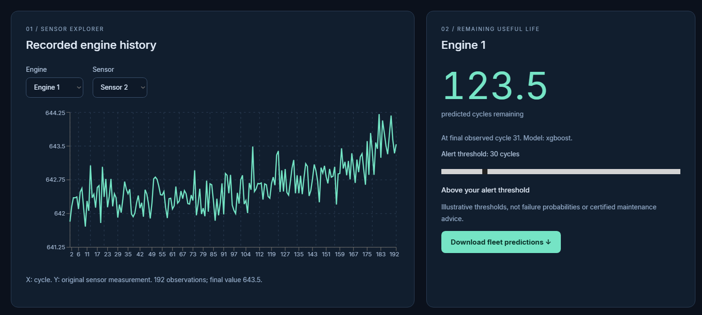
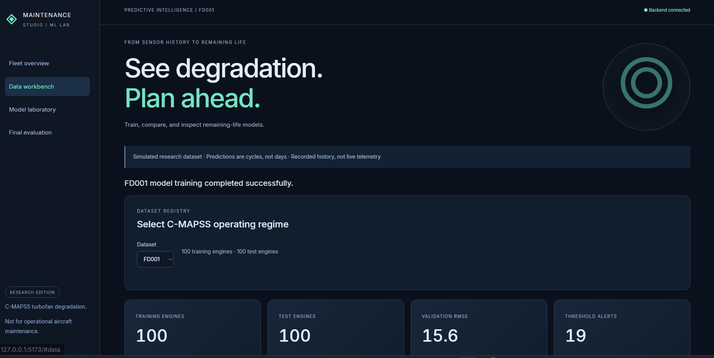
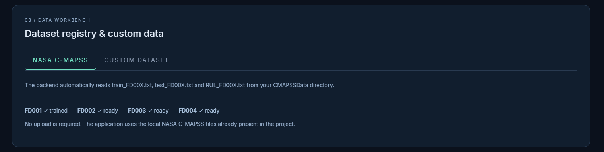
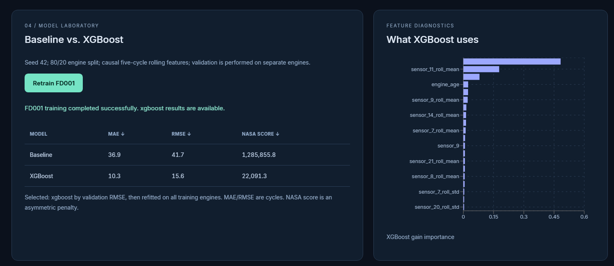
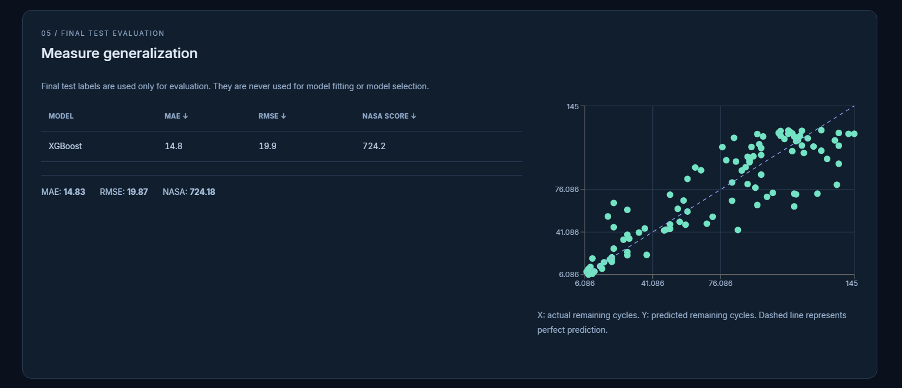
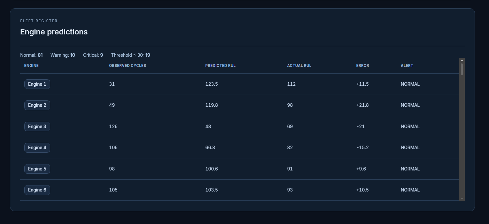

# Predictive Maintenance Studio

### AI-Powered Remaining Useful Life (RUL) Prediction & Fleet Health Analytics

Predictive Maintenance Studio is a full-stack machine-learning application for exploring equipment degradation, estimating **Remaining Useful Life (RUL)**, comparing predictive models, and inspecting fleet-level maintenance risk.

The current implementation uses the **NASA C-MAPSS turbofan engine degradation dataset** as a simulated research benchmark. It is designed as a research/portfolio demonstration rather than a certified aircraft maintenance system.

> **Research Edition** — Predictions are expressed in operating cycles, not calendar days. The application uses recorded/simulated benchmark data, not live telemetry.

---

## Overview

The project connects a machine-learning pipeline with an interactive React dashboard.

The workflow is:

```text
NASA C-MAPSS Data
        │
        ▼
Data Loading & Validation
        │
        ▼
Sensor / Operating-Condition Processing
        │
        ▼
Causal Feature Engineering
        │
        ▼
Engine-Separated Validation
        │
        ├───────────────┐
        ▼               ▼
   Baseline         XGBoost
        │               │
        └───────┬───────┘
                ▼
       Model Comparison
                │
                ▼
      Final Model Refit
                │
                ▼
       Test-Set RUL Prediction
                │
                ▼
        Fleet Risk Dashboard
```

---

## Key Features

- NASA C-MAPSS FD001–FD004 dataset support
- Automatic dataset discovery from `CMAPSSData/`
- Sensor-history exploration by engine and sensor
- Remaining Useful Life prediction in operating cycles
- Baseline vs. XGBoost model comparison
- Engine-separated 80/20 validation
- Causal five-cycle rolling features
- XGBoost feature-importance visualization
- Final test-set evaluation
- MAE, RMSE and NASA asymmetric scoring
- Fleet-level predicted RUL table
- Normal / Warning / Critical threshold classification
- Threshold-based maintenance alerts
- Downloadable fleet predictions
- React + Vite frontend
- FastAPI backend
- Saved trained model and evaluation artifacts
- Research-oriented custom dataset workflow

---

## Dataset

The project uses the **NASA C-MAPSS turbofan engine degradation benchmark**.

The repository contains four operating regimes:

| Dataset | Training Engines | Test Engines |
|---|---:|---:|
| FD001 | 100 | 100 |
| FD002 | 260 | 259 |
| FD003 | 100 | 100 |
| FD004 | 249 | 248 |

Each dataset contains:

- Engine/unit identifier
- Operating cycle
- 3 operating settings
- 21 sensor measurements
- Training trajectories that run to failure
- Truncated test trajectories
- Ground-truth RUL values for final evaluation

The current dashboard example shown in the screenshots is **FD001**.

---

## Machine Learning Pipeline

### 1. RUL target generation

For training trajectories, RUL is generated from the final observed cycle:

```text
RUL = final_cycle - current_cycle
```

The implementation applies a maximum RUL cap of 125 cycles to reduce the influence of very large early-life targets.

The final failure cycle is used only to construct the training target; it is not provided to the model as an input feature.

### 2. Feature engineering

The pipeline uses sensor and operating-condition information together with:

- Engine age / cycle information
- Causal rolling means
- Causal rolling standard deviations
- Five-cycle rolling windows

The rolling features use historical observations only, preventing future observations from leaking into earlier samples.

### 3. Validation

The training data is split by **engine**, rather than randomly splitting individual rows.

Current validation configuration:

```text
80% engines → training
20% engines → validation
Random seed → 42
Rolling window → 5 cycles
```

This keeps observations from the same engine from being simultaneously present in training and validation.

### 4. Models

The dashboard compares:

- A baseline regression model
- XGBoost regression

XGBoost is selected using validation RMSE and then refitted using the complete training-engine set before final test evaluation.

### 5. Evaluation

The project reports:

- Mean Absolute Error (MAE)
- Root Mean Squared Error (RMSE)
- NASA asymmetric scoring metric

MAE and RMSE are measured in operating cycles.

The NASA score applies an asymmetric penalty, making prediction direction important.

---

# Dashboard

## 01 — Sensor Explorer

The Sensor Explorer allows an engine and sensor to be selected to inspect its recorded history.

The chart displays:

- Operating cycle on the X-axis
- Original sensor measurement on the Y-axis
- Number of recorded observations
- Final observed sensor value



---

## 02 — Remaining Useful Life

The RUL panel displays the selected engine's predicted remaining operating cycles.

It also shows:

- Final observed cycle
- Prediction model
- Alert threshold
- Threshold status
- Fleet prediction download

Example FD001 result shown in the dashboard:

```text
Engine 1
Predicted RUL: 123.5 cycles
Final observed cycle: 31
Model: XGBoost
Alert threshold: 30 cycles
```



---

## 03 — Dataset Registry & Data Workbench

The Data Workbench provides access to the NASA C-MAPSS datasets and a custom-dataset workflow.

The NASA registry automatically reads:

```text
train_FD00X.txt
test_FD00X.txt
RUL_FD00X.txt
```

from the local `CMAPSSData/` directory.



---

## 04 — Model Laboratory

The Model Laboratory compares the baseline model against XGBoost using validation metrics.

The dashboard also displays XGBoost gain-based feature importance.

Example FD001 validation result:

| Model | MAE | RMSE | NASA Score |
|---|---:|---:|---:|
| Baseline | 36.9 | 41.7 | 1,285,855.8 |
| XGBoost | 10.3 | 15.6 | 22,091.3 |

These values are from the displayed FD001 training/validation run and should be interpreted as benchmark results for this experiment, not as universal model performance.



---

## 05 — Final Test Evaluation

Final test labels are used only for evaluation after model selection and refitting.

For the displayed FD001 run:

```text
MAE  = 14.83 cycles
RMSE = 19.87 cycles
NASA = 724.18
```

The scatter plot compares:

```text
X-axis → Actual remaining cycles
Y-axis → Predicted remaining cycles
```

The dashed diagonal represents perfect prediction.



---

## 06 — Fleet Register

The Fleet Register provides an engine-by-engine view of:

- Engine ID
- Observed cycles
- Predicted RUL
- Actual RUL
- Prediction error
- Alert state

For the displayed FD001 run:

```text
Normal  : 81
Warning : 10
Critical: 9
Threshold ≤ 30 cycles: 19
```

The classification is an illustrative research threshold and should not be interpreted as a certified maintenance decision.



---

# Example FD001 Results

The displayed experiment produced:

```text
Training engines : 100
Test engines     : 100
Validation RMSE  : 15.6 cycles
Threshold alerts : 19
```

The final test evaluation produced:

```text
MAE  : 14.83 cycles
RMSE : 19.87 cycles
NASA : 724.18
```

The dashboard also exposes the learned XGBoost feature importance, allowing the model's sensor dependencies to be inspected rather than treating the model as a completely opaque predictor.

---

# Project Structure

```text
predictive-maintenance-studio/
│
├── CMAPSSData/
│   ├── train_FD001.txt
│   ├── test_FD001.txt
│   ├── RUL_FD001.txt
│   ├── train_FD002.txt
│   ├── test_FD002.txt
│   ├── RUL_FD002.txt
│   ├── train_FD003.txt
│   ├── test_FD003.txt
│   ├── RUL_FD003.txt
│   ├── train_FD004.txt
│   ├── test_FD004.txt
│   ├── RUL_FD004.txt
│   └── readme.txt
│
├── backend/
│   ├── app.py
│   ├── requirements.txt
│   └── runtime/
│       └── models/
│           ├── FD001_model.joblib
│           ├── FD001_metrics.json
│           └── FD001_predictions.csv
│
├── frontend/
│   ├── src/
│   │   ├── main.jsx
│   │   └── styles.css
│   ├── package.json
│   └── vite.config.js
│
├── screenshots/
│   ├── 01-dashboard-overview.png
│   ├── 02-dataset-and-metrics.png
│   ├── 03-sensor-explorer-and-rul.png
│   ├── 04-data-workbench.png
│   ├── 05-model-laboratory.png
│   ├── 06-final-test-evaluation.png
│   └── 07-fleet-register.png
│
├── .gitignore
├── README.md
└── .gitlab-ci.yml
```

---

# Technology Stack

### Frontend

- React 18
- Vite
- Recharts
- JavaScript / JSX
- Responsive custom CSS

### Backend

- Python
- FastAPI
- Uvicorn
- Pandas
- NumPy
- Scikit-learn
- XGBoost
- Joblib

### Machine Learning

- Regression-based RUL prediction
- XGBoost
- Engine-separated validation
- Rolling sensor features
- MAE
- RMSE
- NASA asymmetric score

### Data

- NASA C-MAPSS turbofan degradation benchmark

---

# API

The FastAPI backend exposes endpoints including:

```text
GET  /api/health
GET  /api/datasets

POST /api/train/{dataset}

GET  /api/metrics/{dataset}
GET  /api/predictions/{dataset}
GET  /api/download/{dataset}

GET  /api/sensors/{dataset}/{unit}?sensor=sensor_2
```

The frontend communicates with the backend through the Vite `/api` proxy.

---

# Installation & Running Locally

## Requirements

Recommended environment:

```text
Python 3.13+
Node.js 18+
npm
Git
```

---

## 1. Clone the repository

```bash
git clone https://github.com/Yuvankrish3012/predictive-maintenance-studio.git
cd predictive-maintenance-studio
```

---

# 2. Start the Backend

Open a terminal in the project root.

### Windows PowerShell

```powershell
cd backend
py -3.13 -m venv .venv
.\.venv\Scripts\python.exe -m pip install -r requirements.txt
.\.venv\Scripts\python.exe -m uvicorn app:app --host 127.0.0.1 --port 8000
```

The backend should be available at:

```text
http://127.0.0.1:8000
```

Health endpoint:

```text
http://127.0.0.1:8000/api/health
```

---

# 3. Start the Frontend

Open a **second terminal** in the project root.

```powershell
cd frontend
npm install
npm run dev
```

Vite will start the frontend, normally at:

```text
http://127.0.0.1:5173
```

Open that address in your browser.

---

# 4. Train a Dataset

After both servers are running:

1. Open the dashboard.
2. Select a C-MAPSS dataset.
3. Start training.
4. Wait for the training completion message.
5. Inspect:
   - Sensor history
   - RUL prediction
   - Model comparison
   - Feature importance
   - Final test evaluation
   - Fleet predictions

The trained artifacts are stored under:

```text
backend/runtime/models/
```

---

# Important Research Note

This project is a **research and portfolio demonstration** built around the NASA C-MAPSS simulated turbofan degradation benchmark.

It should not be interpreted as:

- Live aircraft telemetry
- A certified aircraft-health monitoring system
- A production maintenance decision system
- A guarantee of component failure timing

Predictions represent estimated **operating cycles remaining** within the benchmark's modeling assumptions.

---

# Future Development

Potential extensions include:

- LSTM/GRU sequence models
- Transformer-based degradation modeling
- Uncertainty estimation
- Probabilistic RUL prediction
- Explainable AI with SHAP
- Online sensor-stream ingestion
- Model drift monitoring
- Automated retraining
- Multi-model ensemble prediction
- Custom industrial dataset ingestion
- Digital-twin integration
- Real-time predictive-maintenance APIs
- Containerized deployment

---

# Author

**V Yuvan Krishnan**

B.Tech — Computer Science & Engineering (Artificial Intelligence & Machine Learning)

SRM Institute of Science and Technology

---

## License

This repository is intended for educational, research, and portfolio purposes. Dataset usage remains subject to the terms and conditions of the original NASA C-MAPSS data source.
